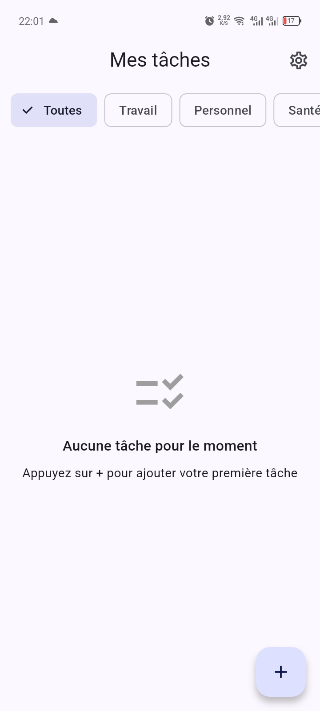
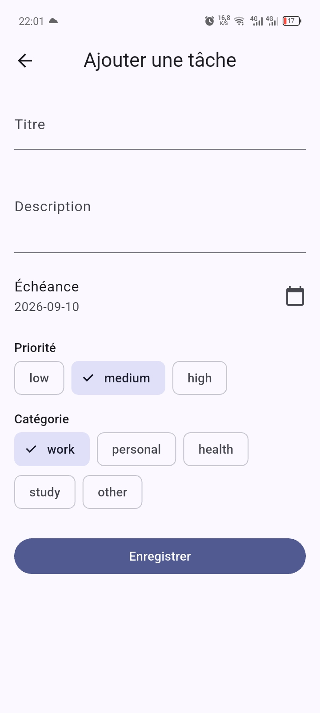
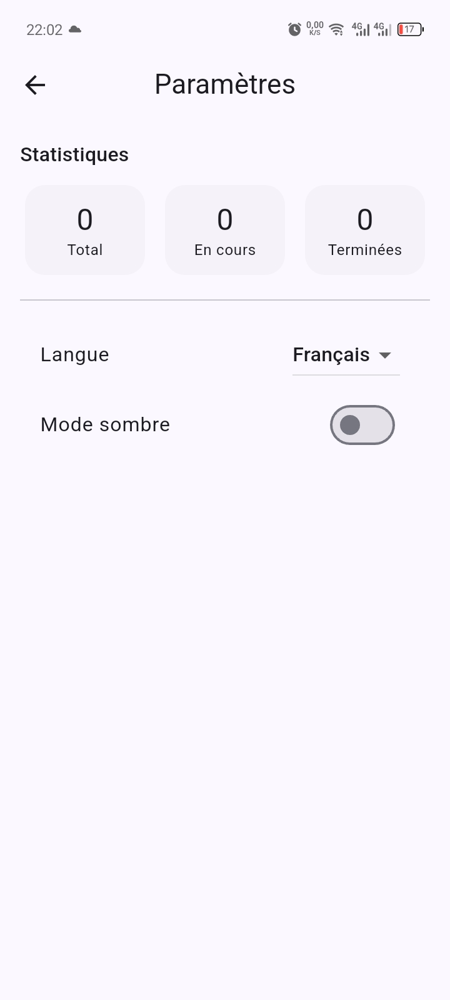

# TaskFlow


TaskFlow is a production-ready Flutter task manager with categories, priorities, offline
persistence, full test coverage, and FR/EN localization. Built as a certification capstone
project to demonstrate a testable, maintainable clean architecture end to end.

> Replace `OWNER` in the badge URL above with your GitHub username once pushed.

## Screenshots

| Home | Add task | Detail | Settings |
|---|---|---|---|
|  |  |  |  |

## Features

- 5 screens: Splash, Home (list + filters), Add/Edit task, Task detail, Settings/Statistics
- Offline-first persistence with Hive — no backend required
- Category and priority filtering
- Dark mode + FR/EN language switching, no restart required
- Full semantic labels for screen-reader accessibility
- 40+ automated tests: unit, widget, and integration

## Architecture

Clean architecture in three layers, dependencies pointing inward:

```
lib/
├── domain/            # Entities, repository contracts, use cases — pure Dart, no Flutter imports
│   ├── entities/       Task, Priority, TaskCategory
│   ├── repositories/   TaskRepository (abstract)
│   └── usecases/       AddTask, UpdateTask, DeleteTask, GetTasks, ToggleTaskCompletion, FilterTasks
├── data/              # Implementation details
│   ├── models/         TaskModel (Hive DTO + entity mapping)
│   ├── datasources/    HiveTaskLocalDataSource
│   └── repositories/   TaskRepositoryImpl
├── presentation/      # Everything Flutter-facing
│   ├── providers/      Riverpod DI wiring + TaskNotifier (StateNotifier) + TaskState
│   ├── screens/         SplashScreen, HomeScreen, TaskFormScreen, TaskDetailScreen, SettingsScreen
│   └── widgets/         TaskCard, PriorityBadge, FilterBar, EmptyState
├── core/              # Theme, shared constants, formatting utilities
└── l10n/              # ARB translation sources (app_en.arb, app_fr.arb)
```

Screens never talk to the repository directly — they read `taskNotifierProvider` and call
`TaskNotifier` methods, which delegate to use cases. This keeps business rules (validation,
sorting, filtering) testable in isolation from any widget tree, and swaps between a Hive
repository in production and an in-memory `FakeTaskRepository` in tests without touching a
single screen.

### State management & performance

- **Riverpod** (`hooks_riverpod`) for DI and reactive state; `flutter_hooks` for local,
  disposable widget state (form controllers, animation-free local values) instead of
  `StatefulWidget` boilerplate.
- List items (`TaskCard`) are `const`-constructible and keyed by task id, so `ListView.builder`
  only rebuilds the row that actually changed — no jank scrolling long lists.
- Images (avatars/thumbnails, where used) go through `cached_network_image` for lazy loading
  and disk caching rather than blocking the frame on a network fetch.

## Getting started

```bash
flutter pub get
flutter gen-l10n
dart run build_runner build --delete-conflicting-outputs   # generates Hive adapters
flutter run --release
```

## Testing

```bash
flutter test                       # unit + widget tests
flutter test integration_test      # integration tests (needs a device/emulator or -d linux/chrome)
flutter test --coverage            # generates coverage/lcov.info
```

| Layer | Location | Count |
|---|---|---|
| Unit | `test/unit/` | 31 tests — entities, use cases, `TaskNotifier`, formatting, Hive mapping |
| Widget | `test/widget/` | 9 tests — `TaskCard`, `PriorityBadge`, `EmptyState`, `FilterBar`, form validation |
| Integration | `integration_test/` | 2 tests — add-task flow, delete-task flow, both through real UI |

## CI/CD

GitHub Actions (`.github/workflows/ci.yml`) runs on every push/PR to `main`:

1. `dart format --set-exit-if-changed` — formatting gate
2. `flutter analyze --fatal-infos` — zero-warning static analysis
3. `flutter test --coverage` — unit + widget suite, coverage uploaded as an artifact
4. `flutter test integration_test -d linux` — integration suite, headless
5. On `main`: builds and uploads a release APK as a workflow artifact

## Internationalization

Locale-neutral strings live in `lib/l10n/app_en.arb` and `lib/l10n/app_fr.arb`. Add a new
language by dropping in `app_<locale>.arb` and adding the locale to
`supportedLocales` in `main.dart`.

## Accessibility

Every interactive control (checkboxes, filter chips, buttons, badges) is wrapped in
`Semantics` with a descriptive label, verified by a dedicated widget test
(`priority_badge_widget_test.dart`) asserting on `find.bySemanticsLabel`.

## License

MIT
